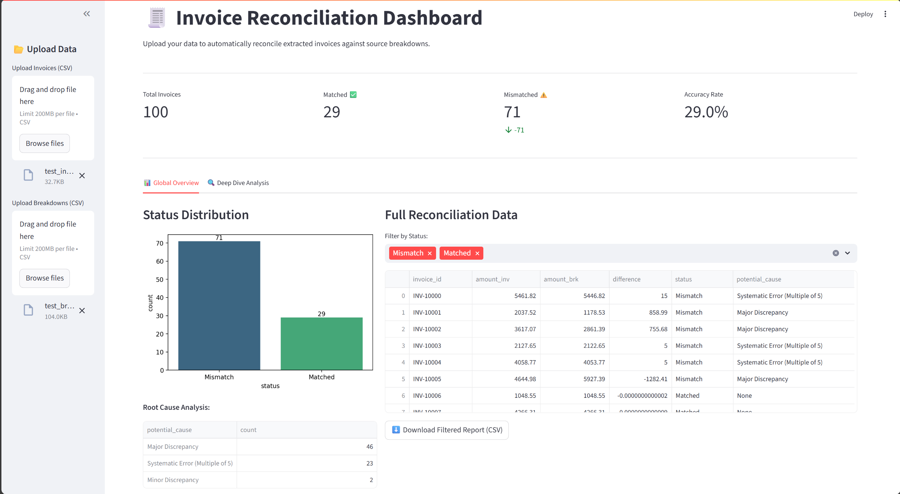
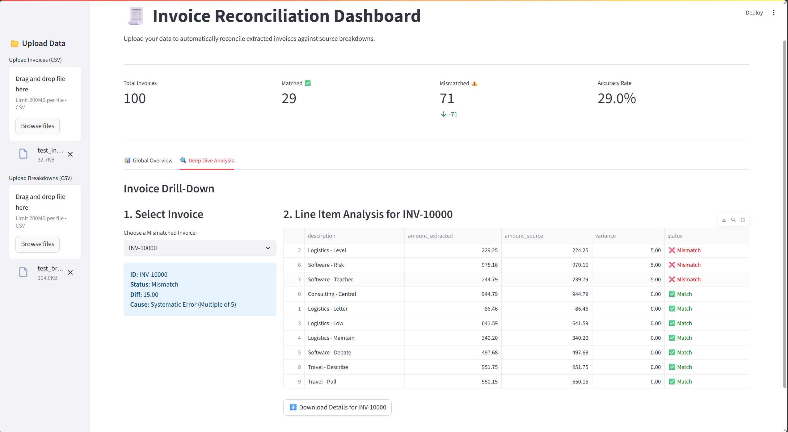

# 🧾 Data-Reconciliation

## Overview

**Data-Reconciliation** is a powerful, interactive Streamlit dashboard for automated reconciliation of invoice data against source breakdowns. Designed for finance, accounting, and operations teams, it provides instant insights, root cause analysis, and deep-dive drilldowns to accelerate your reconciliation workflow and improve data accuracy.

---

## Features

- **Automated Invoice Matching:** Instantly compare extracted invoices with source breakdowns using robust, customizable logic.
- **Root Cause Analysis:** Pinpoint the reasons for mismatches (systematic errors, missing documents, major/minor discrepancies).
- **Interactive Dashboard:** Visualize status distributions, filter results, and download custom reports.
- **Deep Dive Drilldown:** Analyze mismatched invoices at the line-item level for granular troubleshooting.
- **CSV Upload & Download:** Securely upload your own data and export filtered results with a single click.
- **Modern UI:** Built with Streamlit, Matplotlib, and Seaborn for a seamless, beautiful user experience.

---

## Demo

<div align="center">
	
	
</div>

---

## Quick Start

### 1. Clone the Repository

```bash
git clone https://github.com/markmourad26/Data-Reconciliation.git
cd Data-Reconciliation
```

### 2. Install Dependencies

It is recommended to use a virtual environment:

```bash
python -m venv venv
venv\Scripts\activate  # On Windows
pip install -r requirements.txt
```

### 3. Launch the App

```bash
streamlit run app.py
```

### 4. Upload Your Data

- **Invoices CSV:** Should contain columns: `invoice_id`, `line_id`, `description`, `amount`, `date`
- **Breakdowns CSV:** Should contain columns: `invoice_id`, `breakdown_id`, `description`, `category`, `amount`, `date`

Sample files are provided: `test_invoices.csv`, `test_breakdowns.csv`

---

## How It Works

1. **Upload Data:** Use the sidebar to upload your invoices and breakdowns CSV files.
2. **Automated Reconciliation:** The engine matches invoices to breakdowns, calculates differences, and determines status (Matched, Mismatch, Missing).
3. **Root Cause Analysis:** Heuristics identify likely causes for mismatches (e.g., systematic errors, missing documents).
4. **Visualization:** View summary metrics, status distributions, and download filtered reports.
5. **Deep Dive:** Drill down into mismatched invoices to analyze line-item discrepancies and export detailed breakdowns.

---

## Technical Details

- **Frontend:** Streamlit
- **Backend Logic:** Custom Python engine (`reconciliation_engine.py`)
- **Visualization:** Matplotlib, Seaborn
- **Data Handling:** Pandas

### Key Functions

- `reconcile_invoices(invoices_df, breakdowns_df)`: Aggregates and compares invoice totals, returns status and potential cause.
- `reconcile_line_items(invoices_df, breakdowns_df, invoice_id)`: Deep-dive line-item reconciliation for a specific invoice.

---

## File Structure

```
Data-Reconciliation/
├── app.py                   # Streamlit dashboard
├── reconciliation_engine.py # Core reconciliation logic
├── requirements.txt         # Python dependencies
├── test_invoices.csv        # Sample invoice data
├── test_breakdowns.csv      # Sample breakdown data
├── assets/                  # Demo screenshots and images
├── .gitignore               # Git ignore rules
└── README.md                # Project documentation
```
